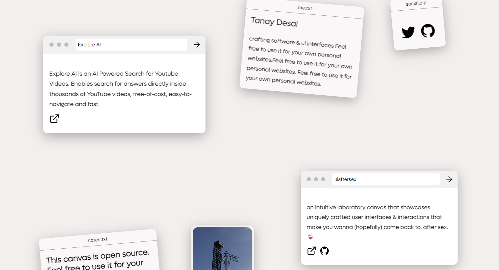

# Canvasify

This is a customizable portfolio website template that allows anyone to easily create their own portfolio canvas. You can edit and add the content you want by modifying the values in the `safariTabs`, `notesTabs`, and `picTabs` arrays in the `content.js` file located in the `components` folder.

## Instructions
First install this repo:

```bash
git clone https://github.com/tanaydesai/canavsify.git
```

To customize the content of your portfolio canvas, follow these steps:

1. Navigate to the `components` folder.
2. Open the `content.js` file.
3. Locate the `safariTabs`, `notesTabs`, and `picTabs` arrays.

```js
// Example safariTabs array (For your Porjects)
const safariTabs = [
  {
    name: "Explore AI",
    text:  <ExploreAI />,
    x:-350,
    y:-200,
    drag: true
},
  // Add more tabs as needed
];

// Example notesTabs array (For normal Notes)
const notesTabs = [
  {
    name:"notes.txt",
    text:"This canvas is open source. Feel free to use it for your own personal websites.", // Can be a component too
    x:-450,
    link:"https://github.com/TanayDesai/canvasify",
    y:400,
    drag: false,
    deg:"-5",
    },
  // Add more tabs as needed
];

// Example picTabs array (For Art/Photography/Any photo really)
const picTabs = [
  { 
    pic: pic3,
    link: "https://tanaydesai5.wixsite.com/tanaydesai",
    width:150,
    height:150,
    x:-100,
    y:-200,
    drag: true,
}
  // Add more tabs as needed
];
```

Then you can connect it to your vercel project!